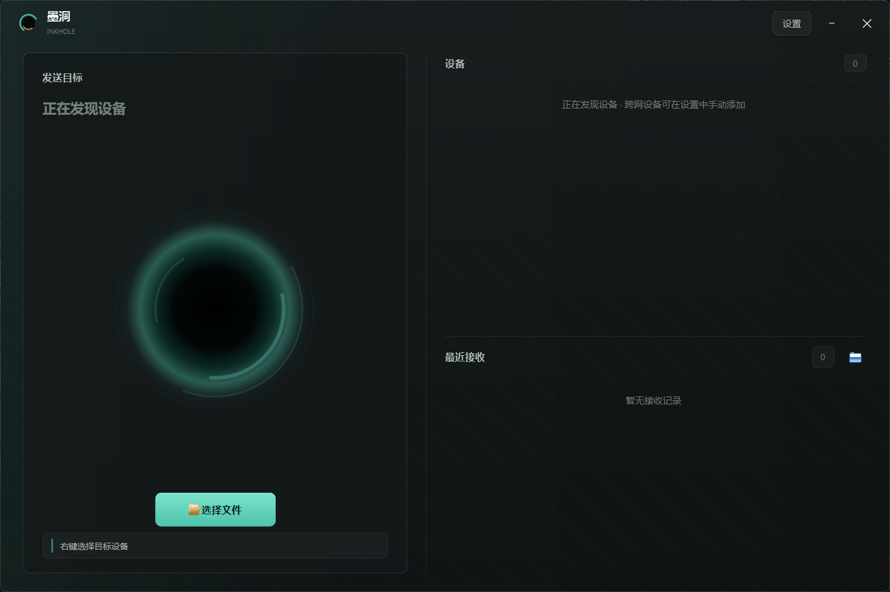

# 墨洞 InkHole

[](https://github.com/RexVane/InkHole/actions/workflows/ci.yml)
[](https://github.com/RexVane/InkHole/actions/workflows/android.yml)
[](LICENSE)

> 跨平台文件传输：局域网自动发现，跨网络支持 Tailscale、Magic Wormhole 一次性短码和自有 SSH VPS 中继。Windows、macOS、Android 共用文件协议。

两台设备在同一个 WiFi 时，mDNS 自动发现后直接传输。不在同一网络时，可以用 Tailscale 建立长期直连、生成一次性安全短码，或让固定设备通过自己的 SSH VPS 会合。文件不会上传到墨洞云盘；三端继续使用 WHPP/WHF1 流式传输、ACK、进度、取消和原子落盘。

## Quick Start

```bash
# 1. 装桌面依赖
pip install -e ".[gui]"

# 2. 编译跨网共享核心（局域网模式不依赖它）
cd transport-core && make build-desktop && cd ..

# 3. 两台电脑各跑一个
PYTHONPATH=src python -m inkhole.pet
PYTHONPATH=src python -m inkhole.pet --name 我的Mac

# 4. 选择目标设备，点击选择发送内容或直接拖入
```

也可以直接 `python -m inkhole`（等价于启动桌宠）。

无图形界面时用命令行版：

```bash
PYTHONPATH=src python -m inkhole.p2p --inbox ~/InkHole/收件箱 --outbox ~/InkHole/发件箱
```

## Windows 桌面端



Windows 主窗口采用双栏工作台布局：左侧固定为发送目标、墨洞动画、文件选择和状态反馈，右侧集中显示设备列表与最近接收。设置页继续在同一窗口内切换，不弹出额外对话框。

默认窗口为 `960×640`，最小支持 `720×480`；小屏幕会自动压缩墨洞区域，传输百分比与实时速度始终保留显示。长设备名、文件名和状态文本会自动省略。墨洞动画使用时间驱动的 60fps 刷新，窗口隐藏或切到设置页时自动停表；设备卡片、页面切换、拖拽状态、布尔开关和传输进度均有短时缓动。

## Features

- **局域网自动发现**：普通 Wi-Fi 注册 `_inkhole._tcp.local.` mDNS 服务；Android 手机热点不转发 mDNS 时自动使用 UDP 广播请求和单播回应兜底。地址提示不会直接进入设备列表，仍须通过 WHPC v3 随机挑战和设备签名验证；服务名带唯一实例 ID，两台同名设备不冲突
- **手动添加设备（跨网络直连）**：自动发现不可用时，在设置里填对方 IP 或 MagicDNS 名称与监听端口（桌面与 Android 均支持）；对端通过 WHPC v3 验证后才显示，首次连接会固定设备身份，地址后来指向其他设备时会拒绝连接；设备离线自动移出列表、回线自动恢复
- **一次性短码**：发送端选择内容后生成 Magic Wormhole PAKE 短码和二维码；接收端先确认设备与内容摘要，再建立端到端加密会话。多文件在同一会话上使用 yamux 独立流，不使用 Magic Wormhole ZIP 传输
- **SSH VPS 中继**：两端只需填写 VPS、SSH 用户并选择或粘贴已有私钥；反向端口仅绑定 VPS 回环地址，PAKE 配对后固定 Noise 身份并默认启用外层端到端加密。首条中继通道建立后会通过 STUN/QUIC 自动尝试 UDP 打洞，直连失败则继续使用 VPS 中继；VPS 不安装墨洞服务，也不保存文件
- **三端共享传输核心**：Windows/macOS 使用 Go sidecar，Android 使用同源 gomobile AAR；Magic Wormhole、SSH、PAKE、Noise 和 yamux 行为保持一致
- **应用内主界面**：深色双栏工作台——稳定的发送区、设备列表、最近接收、应用内设置页和自适应长文本；桌面设置保留双栏布局并采用 Android 同款浮动标签输入框与圆角模态面板，桌宠挂件保留为可开关选项
- **TCP 传输**：WHPP v3 协议（magic + JSON 头 + 文件/文件夹数据 + ACK 与 SHA-256 回执）；局域网直接连接，Tailscale 跨网路径由 Tailscale 负责
- **传输回执（ACK）**：发送正文前先验证目标设备对本次 header、偏移和随机数的签名；只有同一连接上的接收方原子落盘并返回 `ACK_OK + SHA-256` 才算发送成功，超时、断连、EOF、校验失败、磁盘满和拒收都会明确失败
- **断点续传与崩溃恢复**：明文、WHE2/WHE3 加密、普通文件和 WHF1 文件夹都使用持久化 `transfer_id` 与接收偏移；断网、切换网络或进程重启后继续传输。接收方在发布正式目标前先写原子提交日志；即使进程在“目标已改名、完成回执尚未写入”之间退出，重试也会重新校验路径、大小和 SHA-256 后补写回执，不会生成多余的 " (2)" 副本。隐藏检查点、提交日志和完成回执最多保留 7 天
- **传输进度与速度**：主窗口、桌宠和 Android 端均显示墨洞进度环与实时 KB/s、MB/s；传输完成、失败或中断都会可靠清除进度
- **取消发送**：Windows、macOS 与 Android 发送中均可取消当前文件并清空等待队列；对端立即结束进度，未完成内容只保留为不可见的续传检查点，不会成为正式文件
- **端到端加密**：Windows、macOS、Android 设置页均提供独立开关；关闭时保留口令但传输为明文。启用后统一使用 4MB 分块 AES-256-GCM（新传输为 WHE3，兼容接收 WHE2），续传会生成新的随机数流；内存峰值恒定，块序号防篡改/防重排
- **发送队列**：一次拖入多个文件或文件夹会按序发送，完成后聚合报告"已发送 k/N 项"
- **大文件夹流式传输**：桌面端直接发送 WHF1 目录条目流，不预先生成 ZIP，也不把整个文件夹读进内存；对端完整保留目录结构并直接得到可用文件夹。接收方先写隐藏暂存目录，校验完成后原子落盘；不支持 `folder-v1` 的对端回退为 ZIP
- **Android 目录导出**：Android 10+ 将文件逐项导出到 `Download/InkHole/<文件夹名>/` 并保留相对路径；ACK 后、公共目录导出前即使进程被系统终止，下次启动也会从完成回执恢复导出且不会重复记录；受 Scoped Storage 限制，完全空的目录无法可靠创建，会被忽略（普通文件和非空子目录不受影响）
- **设备身份验证**：WHPC 探测和 WHPP 传输都使用 ECDSA P-256 签名随机挑战；局域网身份在每次发现和传输时实时验证，不保存设备信任列表，也不会因旧指纹阻断重新发现
- **检查更新 / 应用内更新**：设置页显示当前版本并可一键检查 GitHub 最新版；双端使用圆角面板显示新版本状态与简洁变化摘要；Windows 打包版可直接在应用内下载覆盖并自动重启，Android 可在设置内下载安装新 APK，无需手动去 Releases 下载再删旧版
- **设置持久化**：设备名、加密开关和目录等非敏感设置写入普通配置；共享传输口令由桌面系统凭据库或 Android Keystore 加密保存，旧版明文配置会在首次启动时自动迁移并清除
- **墨洞桌宠**：PySide6 + QML——墨黑核心、青色吸积弧缓慢旋转、呼吸光晕；发送时碎裂动画 / 接收时拼合动画；贴边自动收起
- **Android 前台服务**：锁屏/切后台持续接收；收到的文件进系统 `Download/InkHole`（文件管理器可见）并发通知，点击直接打开；接收历史持久化
- **系统分享入口**：手机上任意 App 分享 → 墨洞，选中设备即发送，支持多选；已知大小的大文件直接从 `content://` 流式传输，不再完整复制到缓存
- **开机自启**：在应用内设置页切换，Windows 注册表 / macOS LaunchAgent / Linux .desktop（不含明文口令）
- **接收防御**：文件名 basename 裁剪与文件夹逐级路径校验防 `../` 穿越；拒绝绝对路径、符号链接、特殊文件和跨平台大小写重名；size 合法性校验 + 磁盘余量检查；半截文件/文件夹绝不落盘

## 跨网络传输

### Tailscale 长期直连

不在同一个 WiFi 下（异地/公司-家里）时，推荐配合 [Tailscale](https://tailscale.com)（免费）：

1. 两台电脑都安装 Tailscale 并登录**同一账号**——每台设备会获得一个固定的 `100.x.x.x` 虚拟 IP；
2. 两台电脑的墨洞：设置 → 监听端口改为固定值（建议 1024-49151，如 `41300`，避开系统随机占用的 49152+ 动态区）→ 保存；
3. 墨洞：设置 → **手动添加设备** → 填对方的 Tailscale IP 或 MagicDNS 名称与端口 → 添加。

保存固定端口时，如果端口已被占用，墨洞会停止节点并明确报错，不会偷偷换成随机端口。之后只要两端 Tailscale 在线，打开墨洞即可互见互传；能打洞直连时速度取决于两边网络，无法直连时 Tailscale 可能自动通过加密 DERP 中继。设备离线会自动从列表消失，回线后几秒内自动恢复。

### 一次性短码

发送端打开“跨网络传输”，选择一个或多个文件并生成短码。接收端输入短码或扫描二维码，核对发送设备与内容摘要后确认接收。短码只使用一次，默认十分钟失效；配对服务和传输中继无法读取文件内容。

### SSH VPS 长期中继

VPS 只需运行 SSH，并允许 TCP forwarding。两端填写 VPS 地址、SSH 端口、用户名，选择私钥文件或粘贴已有私钥，验证并固定主机指纹后启用中继。任意一端生成配对码，另一端输入后即可成为长期设备。远端端口自动选择并仅绑定 `127.0.0.1`，无需额外开放公网端口。

详细设计、安全边界和命名说明见 [跨网络传输方案](docs/跨网络传输方案.md)。

## 安全模型（请阅读）

墨洞面向**可信局域网**（家里/自己的路由器）设计：

- **不保存局域网信任列表**：WHPP v3 会验证发送方设备签名，但会接受任意拥有有效墨洞设备身份的发送方。公共 WiFi 应启用端到端加密口令，或改用一次性短码、Tailscale、SSH 中继。
- **口令的双重作用**：端到端加密开关启用时，口令保证文件内容端到端加密；口令不一致的文件会被拒收并回执失败——同时起到"只接收知道口令的设备"的准认证作用。关闭开关会保留口令，但发送内容为明文。
- **敏感信息不写普通配置**：局域网 WHPP 的共享口令、SSH 私钥正文、私钥口令和 Noise 私钥均由桌面系统凭据库存储，Android 端使用 Android Keystore 加密存储；旧版 `config.json` / `SharedPreferences` 中的明文共享口令会自动迁移并删除。
- 一次性短码通过 Magic Wormhole 的 PAKE 建立加密通道；SSH 配对也使用 PAKE，并固定 Noise 公钥。SSH 外层加密默认开启，关闭后 VPS 管理员可能看到转发内容。
- 墨洞没有云端文件存储。Tailscale 可能通过 DERP 中继密文；短码可能通过 Transit 中继密文；SSH 模式由用户自己的 VPS 转发流量。

## 启动参数

参数改一次就会记住（写入配置文件），下次双击直接生效；桌面端也可以在应用内设置页修改。

| 参数 | 说明 | 默认 |
|------|------|------|
| `--inbox` | 收件箱目录 | 随平台（Win: `桌面\inkhole`（自动识别 OneDrive 重定向），Mac: `~/Documents/inkhole`） |
| `--port` | P2P 监听端口（0 = 操作系统自动分配） | `0` |
| `--name` | 本机显示名（对端菜单里看到的名字） | 主机名 |
| `--secret` | 端到端加密口令（两台设备必须一致） | 关 |
| `--size` | 挂件边长像素（0 = 随系统自适应） | `0` |

## 下载（免装环境，直接用）

前往 [Releases](https://github.com/RexVane/InkHole/releases) 下载：

版本标签只有在 Windows、macOS 和 Android 构建、签名与校验全部成功后才会创建 Release，避免下载到缺少平台产物的半成品版本。

| 平台 | 文件 | 用法 |
|------|------|------|
| Windows | `InkHolePet-windows.zip` | 解压后双击 `InkHolePet\InkHolePet.exe` |
| macOS | `InkHolePet-macos.zip` | 解压拖进"应用程序" |
| Android | `InkHole-v*.apk` | 64 位 ARM 手机直接安装；其他架构选择带 ABI 后缀的 APK |

也可以自行打包：

```bash
# Windows
cd packaging && build-windows.bat        # 产物:packaging\dist\InkHolePet\

# macOS
cd packaging && bash build-mac.sh         # 产物:packaging/dist/InkHolePet.app

# Android
cd android && ./gradlew assembleDebug     # 产物:android/app/build/outputs/apk/debug/app-debug.apk
# 或 GitHub Actions 自动构建: gh workflow run android.yml
```

## 常见问题

### Windows：提示"Windows 已保护你的电脑"

正式 Release 使用 Authenticode 签名；首次发布或证书信誉尚未建立时，SmartScreen
仍可能提示确认。自行本地构建的未签名版本需要点击**更多信息** → **仍要运行**。

### Windows：首次运行弹出防火墙提示

墨洞需要在局域网收发文件：点击**允许访问**（至少勾选"专用网络"）。

### macOS：提示"无法验证开发者"或"已损坏，无法打开"

正式 Release 使用 Developer ID 签名并经过 Apple notarization。若正式包仍出现该提示，
应重新下载并核对同名 `.sha256`，不要通过移除 quarantine 属性绕过系统验证；自行构建的
未签名版本不具备 notarization。

### 找不到其他设备

1. 确认两台设备连的是**同一个 WiFi/网段**（`ipconfig` / `ifconfig` 查看 IP 是否同段）
2. 防火墙放行应用（mDNS 依赖 UDP 5353 端口）
3. 避开访客网络/企业网络——它们常开 AP 隔离，设备间互相不可见
4. 开着 VPN 时若发现异常，先断开 VPN 再试

### 跨网络怎么传？

见上文[「跨网络传输」](#跨网络传输)，按使用场景选择 Tailscale、一次性短码或 SSH VPS 中继。

### 问题反馈

提 [Issue](https://github.com/RexVane/InkHole/issues) 时请附上：操作系统与版本、应用版本（如 v1.5.0）、网络环境（家庭 WiFi / 公司网络 / 热点）、具体报错信息或截图。

## Tests

```bash
make test        # Python 桌面测试 + Go 共享核心 race 测试
```

当前 Python 套件为 `122 passed`，覆盖三块：**P2P 引擎端到端**（TCP 传输、取消与双方结束回调、WHE2 分块端到端加密、WHPC v3 身份与能力协商、WHF1 文件夹流、路径穿越与重名防御、原子落盘、发布后崩溃恢复、设备选择和在线状态等）、**手动添加设备**（验证后上线、首次身份固定、离线剔除与回线自动恢复、配置增删同步）、**桌面主窗口离屏冒烟**（bridge 契约、响应式设置页、手动设备 UI、混合内容选择、版本比较与进度清理）。Android 另有 48 项协议、存储、提交日志恢复、热点发现、Tailnet 地址和更新单元测试及 Lint。

桌面端同名文件或文件夹：收件箱已有同名项时自动加 " (2)" 后缀，绝不覆盖；传输中断只留下最长保留 7 天的隐藏续传检查点，不会留下正式文件或目录。若正式目标已经发布但进程来不及写完成回执，桌面与 Android 都会先验证提交日志和内容摘要再恢复；目标被改动时不会假成功，而是重新接收并保留被改动的原文件。Android 文件夹导出也会选择唯一根目录名。

## Project Structure

```text
.
├── src/inkhole/              # Python 包
│   ├── __init__.py            # 顶层包
│   ├── __main__.py            # 入口(python -m inkhole 启动桌宠)
│   ├── p2p.py                 # P2P 引擎(mDNS 发现 + 手动设备 + TCP 直连 + ACK/进度 + 加密)
│   ├── crypto.py              # 端到端加密原语（WHPP v3 使用 WHE3 分块流）
│   ├── pet.py                 # 应用生命周期、桌宠、配置持久化与发送队列
│   ├── mainwindow.py          # QtWidgets 桌面主窗口、设置页与交互动效
│   ├── branding.py            # 品牌图标绘制(托盘/任务栏/图标文件共用)
│   └── inkhole.qml           # 墨洞视觉与动画(吸积弧/进度环/碎片吞吐)
├── tests/
│   ├── test_p2p.py            # P2P 引擎端到端测试
│   ├── test_manual_peers.py   # 手动添加设备(直连/探活恢复/配置同步)
│   └── test_mainwindow_smoke.py # 主窗口离屏冒烟(bridge 契约)
├── assets/                    # 应用图标(png/ico/icns,由 generate-icons.py 生成)
├── transport-core/            # Windows/macOS sidecar 与 Android 共用的 Go 跨网核心
│   ├── core/                  # Magic Wormhole、SSH、PAKE、Noise、yamux
│   ├── mobile/                # gomobile AAR 入口
│   └── third_party/           # 本地 wormhole-william 分支与许可证
├── packaging/                 # 轻量 app 打包(PyInstaller -> .exe/.app)
├── android/                   # Android 客户端(Kotlin + Compose + 前台服务)
├── docs/                      # 使用与实现文档
├── THIRD_PARTY_NOTICES.md     # 第三方依赖与本地 fork 说明
├── .github/workflows/         # CI
├── Makefile
├── pyproject.toml
└── README.md
```

## License

本项目采用 [MIT License](LICENSE) 开源，Copyright (c) 2026 RexVane。

欢迎学习、使用、改造与二次开发。
